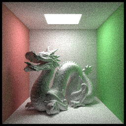
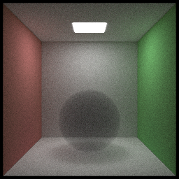
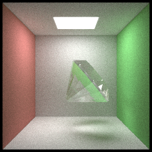
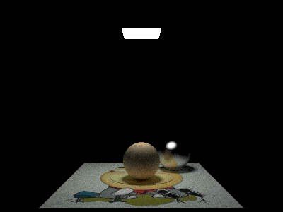

# HJRT

HJRT is a portable C++14 path tracing renderer which renders image using naive brute force path tracing algorithm.

**Features**

+ basic material and texture
+ multi-thread and spiral block rendering
+ BVH 
+ depth of field
+ obj model loading 
+ participating media rendering, like fog 
+ multi-format image export

HJRT uses [Dear Imgui](https://github.com/ocornut/imgui) as program GUI to show rendering result and progress real-time, check out.

More results:

**Acknowledge**

This project is inspired by

[Ray Tracing from the Ground Up 1st Edition](https://www.amazon.com/Ray-Tracing-Ground-Kevin-Suffern-ebook-dp-B01E6SGV8Q/dp/B01E6SGV8Q/ref=mt_kindle?_encoding=UTF8&me=&qid=1191938342)

[smallpt](http://www.kevinbeason.com/smallpt/)

[ray tracing in one weekend](https://github.com/petershirley/raytracinginoneweekend)

**More functions come soon or never**

