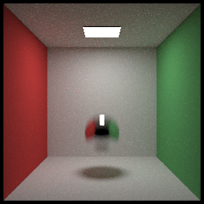

# HJRT

HJRT is a portable C++14 path tracing renderer which renders image using naive brute force path tracing algorithm.

### Features

+ basic material and texture
+ spherical environment map
+ multi-thread and spiral block rendering
+ BVH 
+ depth of field and motion blur
+ obj model loading 
+ participating media rendering, like fog 
+ multi-format image export
+ multiple importance sampling

HJRT uses [Dear Imgui](https://github.com/ocornut/imgui) as program GUI to show rendering result and progress real-time, check out.

### More results:

  

   
 
**left: MIS @ 20spp took 27s; &emsp;&emsp;&emsp;&emsp;&emsp;&emsp;&emsp;&emsp;&emsp;&emsp;&emsp;&emsp;&emsp;&emsp;&emsp;&emsp;&emsp;&emsp;&emsp; center:PT @ 20spp took 35s; &emsp;&emsp;&emsp;&emsp;&emsp;&emsp;&emsp;&emsp;&emsp;&emsp;&emsp;&emsp;&emsp;&emsp;&emsp;&emsp; right:PT @ 200spp took 287s**

*Multiple Importance Sampling*

   

*Motion Blur*

###  Acknowledge

This project is inspired by

[Ray Tracing from the Ground Up 1st Edition](https://www.amazon.com/Ray-Tracing-Ground-Kevin-Suffern-ebook-dp-B01E6SGV8Q/dp/B01E6SGV8Q/ref=mt_kindle?_encoding=UTF8&me=&qid=1191938342)

[smallpt](http://www.kevinbeason.com/smallpt/)

[ray tracing in one weekend](https://github.com/petershirley/raytracinginoneweekend)

**More functions come soon or never**

