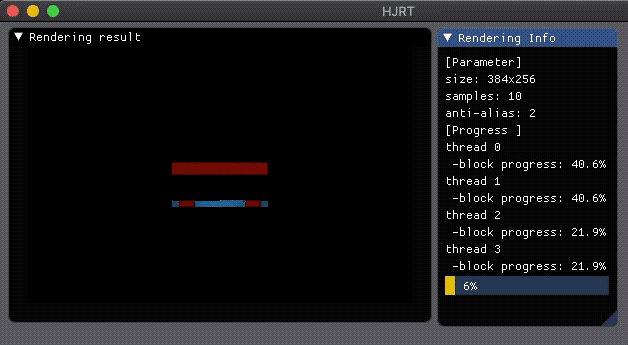

# HJRT

HJRT is a portable C++14 path tracing renderer which renders image using naive brute force path tracing algorithm.

## Features

+ basic material and texture
+ spherical environment map
+ multi-thread and spiral block rendering
+ BVH 
+ depth of field and motion blur
+ obj model loading 
+ participating media rendering, eg, fog 
+ multi-format image export, eg, ppm, jpg, png, exr
+ multiple importance sampling
+ adaptive sampling
+ multi-integrator
  + direct illumination
  + path tracer
  + explicit lighting path tracer

HJRT uses [Dear Imgui](https://github.com/ocornut/imgui) as program GUI to show rendering result and progress real-time, check it out.

## More results:

  

 &emsp;  &emsp;  
 
*left: MIS @ 20spp took 22s; &emsp;&emsp;&emsp;&emsp;&emsp; center:PT @ 20spp took 31s; &emsp;&emsp;&emsp;&emsp;&emsp; right:PT @ 200spp took 3m50s*

**Multiple Importance Sampling**

 &emsp;  &emsp;  

**Motion Blur**

##  Acknowledge

This project is inspired by

[Ray Tracing from the Ground Up 1st Edition](https://www.amazon.com/Ray-Tracing-Ground-Kevin-Suffern-ebook-dp-B01E6SGV8Q/dp/B01E6SGV8Q/ref=mt_kindle?_encoding=UTF8&me=&qid=1191938342)

[smallpt](http://www.kevinbeason.com/smallpt/)

[ray tracing in one weekend](https://github.com/petershirley/raytracinginoneweekend)

**More functions come soon or never**

