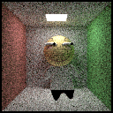
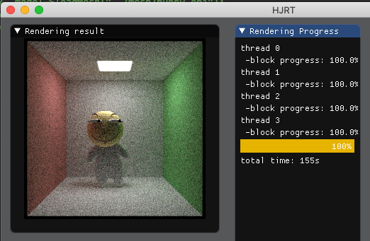

### debug log 2019-6-18

**bug: strange black pixel in the legs of Huaji**



cause: wrong intersection judgement
 
the black pixels should be the floor which occludes the legs of Huaji, but we rendered the legs of Huaji.

Why the pixels are black? because we make the wrong judegement that the intersection occur in the legs of Huaji, and the scatter rays start from Huaji's legs cann't reach any light thus turn black.

The wrong intersectin judegement caused by the neglect of previous hitInfo.t in BVH class's intersection judgement codes.
```cpp
if(aabb.hit(ray)){
		HitInfo leftInfo,rightInfo;
		bool leftHit=leftNode== nullptr?false:leftNode->intersect(ray,&leftInfo);
		bool rightHit=rightNode==nullptr?false:rightNode->intersect(ray,&rightInfo);
		//if intersection occurs, hitInfo is always overrided regardless of the hitInfo.t which is smaller than rightInfo.t or leftInfo.t
		if(leftHit&&rightHit){
			*hitInfo=leftInfo.t<rightInfo.t?leftInfo:rightInfo;
			return true;
		}else if(leftHit){
			*hitInfo=leftInfo;
			return true;
		}else if(rightHit){
			*hitInfo=rightInfo;
			return true;
		}
	}return false;
```

fix:

```cpp
if(aabb.hit(ray)){
		HitInfo leftInfo,rightInfo;
		bool leftHit=leftNode== nullptr?false:leftNode->intersect(ray,&leftInfo);
		bool rightHit=rightNode==nullptr?false:rightNode->intersect(ray,&rightInfo);
		//Fix:
		if(leftInfo.t>hitInfo->t&&rightInfo.t>hitInfo->t)return false;
		if(leftHit&&rightHit){
			*hitInfo=leftInfo.t<rightInfo.t?leftInfo:rightInfo;
			return true;
		}....
	}return false;
```

Correct result:




### new test result

stanford dragon @ 256*256 resolution, 200samples

rendering took 28min

