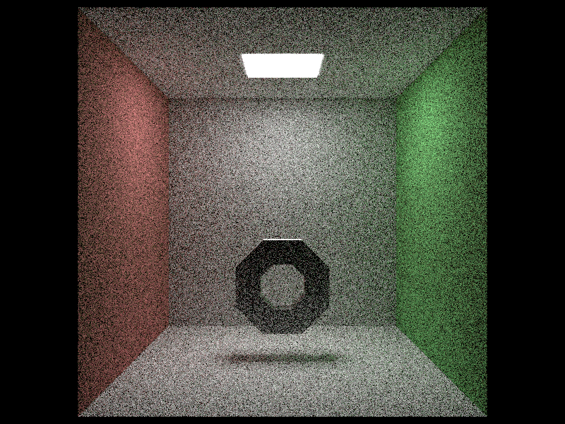
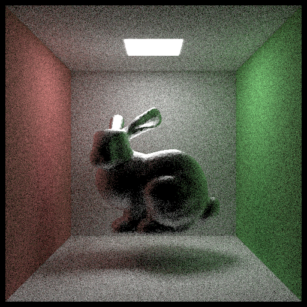
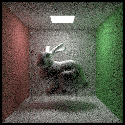
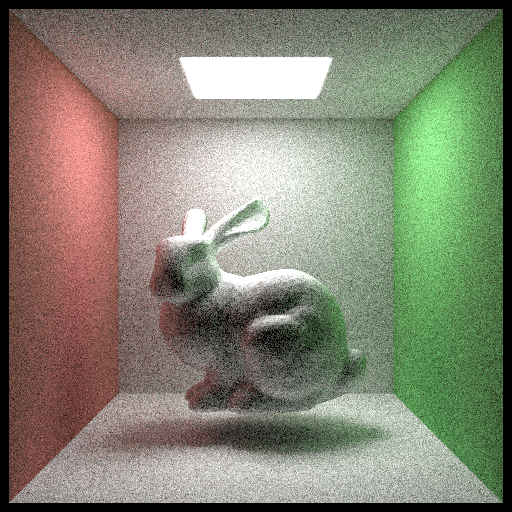

### debug log 2019-6-8
**mesh rendering test**

rendering is much faster by using BVH

test result:


parameter:
4 threads,20 samples,rendering took 330s




parameter:
4 threads,50 samples,512*512,rendering took 1188s(19m48s)

actually there is a bug in the picture, there is unusual shadow in bunny's ears and body which caused by un-normalized normal data

in `objects.cpp`

```cpp
normal=glm::vec3(mat*glm::vec4(normal,0.0f));
```

fix:

```cpp
normal=glm::normalize(glm::vec3(mat*glm::vec4(normal,0.0f)));
```

here is the fixed result:



parameter:
4 thread, 20 samples,256*256,rendering took 311s



parameter:
4 threads,50 samples,512*512,rendering took 1168s

