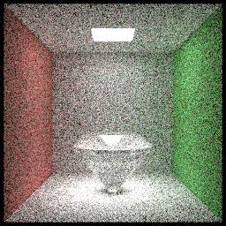
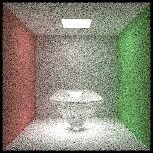
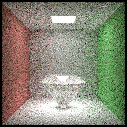
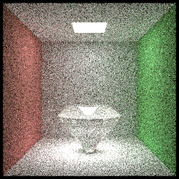

### debug log 2019-7-10

*Update in 2019-7-20*

*Following diamond images are actully wrong! See debug log 2019-7-20*

Today I fixed a severe bug on Russian roulette.
Russian roulette in previous code is wrong, I just ignore the extra contribution of a path surviving from Russian roulette, which equal to 1-(1/survivalProbability).
Set **F** as real radiance.

$$
F'=
\begin{cases}
\frac{F}{1-q}& \text{x>q}\\
0& \text{other}
\end{cases}
$$
Thus, make the expect of **F'** :
$$
E[F']=(1-q)*(\frac{E[F]}{1-q})=E[F]
$$

Wrong RR:

Correct RR @ 3 cut bounce:

Correct RR @ 5 cut bounce:

Correct RR is brighter!
