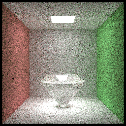
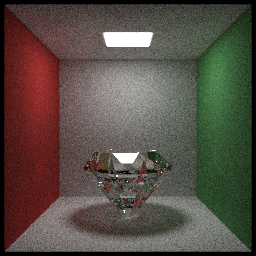

#### debug log 2019-7-20

In the past few days, I fixed some bugs and refactored some legacy codes.
And I found a huge bug during doing these work.

In previous diamond rendering result, showed as below, everything looks fine at the first glance.




There are some refractions inside the diamond, and reflection is good.
But they are NOT real!!!!!!

Correct result:



(NOTE. I changed the color of right wall and left wall, but that's okay, never mind)

The correct one has more refractions! It looks like a real diamond not a glass one.

So what caused this huge bug? It was caused by the triangle intersection judegement code.

Previous code:
```cpp
hitInfo->normal = this->normal * sgn(glm::dot(-t * ray.dir, this->normal);
```
Due to my kindness, I made normal alway be in the same side of incoming ray, this caused wrong refraction result.

Fix:
```cpp
hitInfo->normal = isDoubleSided ? this->normal * sgn(glm::dot(-t * ray.dir, this->normal))
	                               : this->normal;
```