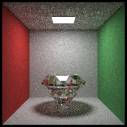

### debug log 2019-7-26

Today I just finished Multiple Importance Sampling which significantly improves rendering efficiency.

Our MIP combines Direct Light Sampling and Cosine Weight Sampling and is able to reduce noise significantly.

    
 
 left: MIS@20spp took 27s; center:PT@20spp took 35s;  right:PT@200spp took 287s
 
 As shown above, MIS has obvious speed and quality advantages.