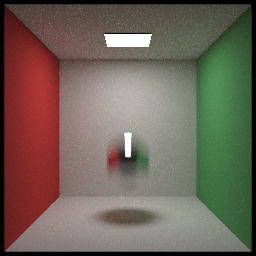

### debug log 2019-7-31

These days I had been implementing motion blur algorithm which requires many code refactorings.

I found a strange bug when testing motion blur algorithm: motion blur effect was good but the shadow of the moving object disappeared, which bothered me a lot.

I debuged code for several hours and found it was caused by missing ray time.

I added *time* variable in *Ray* calss for motion blur rendering while forgot to add time tag for secondary scattering ray, thus the time tag of secondary rays and their follow-up rays would be ZERO or even RANDOM value. So follow-up rays would hit wrong object and result in wrong intersection and scattering.

Fix: add time tag for follow-up rays in **scatter** and **scatterPro** function

   

Correct Motion Blur