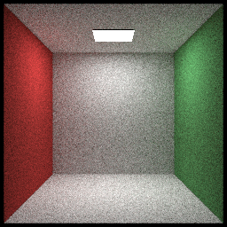
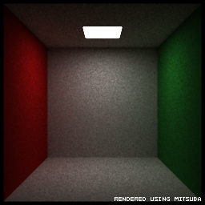
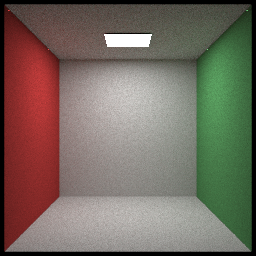
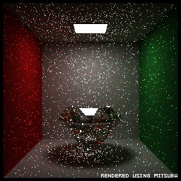

### debug log 2019-8-4 Sunday

I fixed many bugs and did a relative big code refactor this weekend and HJRT is a real path tracing renderer now ;)

Let's talk about bugs first. I found that even the naive path tracing result of HJRT was not similar to Mitsuba's result. The glow area on walls are too shinny and concentrated in HJRT's result where Mitsuba's result were more soft. And white walls in Mitsuba's result were warmer.

  

*Left:HJRT , Right:Mitsuba*

Actually I was pretty sure it was caused by the scattering ray sampling method introduced in RayTracingOneWeekend by adding a random point in sphere and surface normal then normalizing sum. It is not a cosine weighted sampling but I can't prove it.
By using a real cosine weighted sampling method I got a similar result.

*Fixed result*

Then came a new bug, the white walls turned whiter when I used a Mixture sampling(MIS). This really bothered me a lot, I had no idea why this happened. Few days later I still didn't find cause.
In Aug 3 Saturday, I thought maybe it had something to do with mixture sampling pdf and started to review MIS code and as soon as I saw the pdf calculation code of Mixture Sampler I known I fucked up here. I did write the wrong pdf value. After correcting the code, the result was very close to Mitsuba's result. Even the noise pattern was same! What a magic!

 

*Left:HJRT , Right:Mitsuba*

After some other code refactors, HJRT finally looks like a real PT renderer.